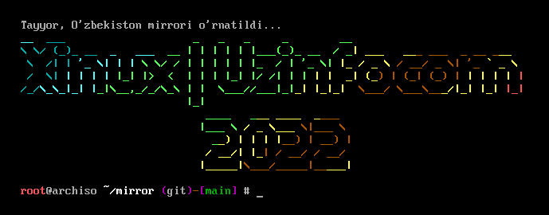

# <center>Arch Linux </center>


<center>Arch Linux uchun TAX-IS internet hududida yangilanish bazasi</center>



<p>Foydalanish:</p>

```
git clone https://github.com/anvaralimov/mirror
cd mirror
sudo sh install.sh
```

Yangilanish serveri `mirror.dc.uz`. Server TAS-IX hududida joylashgan. Shu sababli Sizga 200MB/Sgacha tezlikda fayllarni yuklab olish imkonini beradi (Agar siz uzonline va boshqa O'zbekiston provayderlaridan foydalansangiz...). 

<p>Qo'llab quvvatlanadigan distributivlar </p>

<ul>
<li>Arch Linux</li>
<li>Arco Linux</li>
<li>EndeavourOS</li>
<li>Garuda</li>
<li>pearOS (Arch)</li>
<li>BalckArch</li>
<li>XeroLinux</li>
<li>Archlabs</li>
<li>Archman</li>
<li>ArchStrike</li>
</ul>

Kerak bo'luvchi vositalar:
```
git
curl
cd
bash / sh / zsh / fish
```

<center>Yuqori Tezlikdan rohatlaning</center>
<center>Xinux  |  Uzinfocom  2022</center>